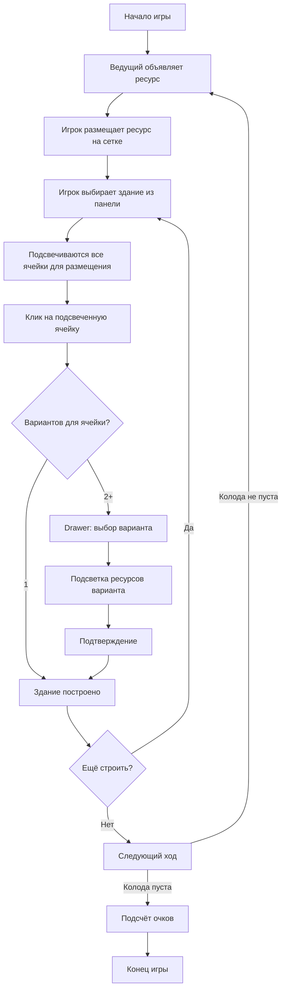

# Tiny Towns — Архитектура

## Стек

| Слой               | Технология                 | Версия |
| ------------------ | -------------------------- | ------ |
| Рендер / JSX       | `@reatom/jsx`              | 1000.x |
| Стейт-менеджмент   | `@reatom/core`             | 1000.x |
| Язык               | TypeScript                 | 5.9    |
| Сборщик            | Vite (OXC)                 | 8 beta |
| Линтер / форматтер | oxlint + oxfmt (ultracite) | —      |

Reatom v1000 — библиотека реактивных атомов. Атом (`atom`) — единица состояния. `computed` — вычисляемое значение. `action` — мутация, обёрнутая в транзакцию.

`@reatom/jsx` — JSX-рантайм, который рендерит DOM напрямую (без виртуального DOM). Компоненты — обычные функции, возвращающие DOM-элементы. Реактивность — через передачу атомов/computed в JSX-атрибуты.

## Структура файлов

```
src/
├── index.tsx            # точка входа, mount в DOM
├── app.tsx              # корневой компонент, layout
├── style.css            # дизайн-система (CSS custom properties) + все стили
│
├── model/               # бизнес-логика (чистая от UI)
│   ├── types.ts         # типы, константы, интерфейсы
│   ├── buildings.ts     # реестр зданий, scoring-функции, calculateGridScore
│   ├── patterns.ts      # сопоставление паттернов, генерация вариантов (повороты/отражения)
│   ├── player.ts        # фабрика reatomPlayer — изолированное состояние одного игрока
│   └── game.ts          # фабрика reatomGame — фазы игры, колода ресурсов, управление игроками
│
└── ui/                  # компоненты (отображение + обработка ввода)
    ├── grid.tsx          # сетка 4×4
    ├── cell.tsx          # одна ячейка с drag-and-drop и click-обработкой
    ├── resource-panel.tsx # панель ресурсов (drag + click-to-select)
    ├── build-panel.tsx    # рецепты зданий (справочная информация)
    ├── drawer.tsx         # generic bottom-sheet с swipe-to-dismiss
    └── build-drawer.tsx   # содержимое drawer — выбор варианта строительства
```

## Модель данных

### types.ts — ядро типов

- **Resource** — `"wood" | "stone" | "wheat" | "brick" | "glass"` — 5 типов ресурсов
- **BuildingType** — `"cottage" | "farm" | "well" | "chapel" | "tavern" | "bakery" | "warehouse" | "tradingPost"` — 8 типов зданий
- **CellContent** — `null | { type: "resource", resource } | { type: "building", building, stored }` — содержимое одной ячейки. `stored: Resource[]` — ресурсы, хранящиеся на здании (для коммерческих зданий)
- **PatternCell** — `{ dr, dc, resource }` — смещение + ожидаемый ресурс в паттерне здания
- **BuildingDef** — определение здания: имя, иконка, описание, паттерн, `score(ctx) → number`, опциональные `storageCapacity` и `hooks`
- **BuildingHooks** — хуки жизненного цикла здания: `matchAsResource`, `onBuild`, `modifyPlacement`, `masterBuilderRestriction`
- **BuildMatch** — найденное совпадение на сетке: тип здания, индексы ячеек, `wildcardCells` (ячейки зданий-ресурсов), ключ
- **ScoringContext** — контекст для scoring: индекс здания, вся сетка, список всех зданий (с `stored`)

### buildings.ts — реестр зданий

Каждое здание — запись в `BUILDINGS: Record<BuildingType, BuildingDef>`. Scoring-логика встроена в каждое определение:

| Здание           | Очки                                                         | Хуки              |
| ---------------- | ------------------------------------------------------------ | ----------------- |
| Коттедж 🏡       | +3 если снабжён кормильцем                                   | —                 |
| Ферма 🌻         | ƒ кормит до 4 коттеджей в любом месте города                 | —                 |
| Колодец ⛲       | +1 за каждый смежный коттедж (независимо от снабжения)       | —                 |
| Часовня ⛪       | +1 за каждый снабжённый коттедж на всём поле                 | —                 |
| Таверна 🍺       | Групповой бонус: 2 / 5 / 9 / 14 / 20 (суммарно, не поштучно) | —                 |
| Пекарня 🍞       | +3 если рядом есть здание-кормилец (ферма)                   | —                 |
| Склад 📦         | Хранит до 3 ресурсов, -1 VP за каждый хранимый ресурс        | —                 |
| Торговый пост 🏪 | +1 VP                                                        | `matchAsResource` |

Пустые ячейки получают штраф `-1` каждая. Итоговый счёт считает `calculateGridScore(grid)`.

### patterns.ts — сопоставление паттернов

- `normalizePattern` — сдвигает паттерн в начало координат, сортирует
- `rotatePattern90` / `mirrorPattern` — повороты и отражения
- `generateVariants(pattern)` — до 8 уникальных ориентаций (4 поворота × 2 отражения)
- `findMatches(getCellContent)` — перебирает все здания × все варианты × все позиции якоря. Возвращает массив `BuildMatch[]`. Поддерживает wildcard-ресурсы: если ячейка содержит здание с хуком `matchAsResource`, оно может заменить любой ресурс в паттерне. Такие ячейки попадают в `BuildMatch.wildcardCells`.

Варианты кешируются в `allVariantsCache: Map<BuildingType, PatternCell[][]>`.

### Система хуков зданий (BuildingHooks)

Здания могут объявлять хуки — функции, вызываемые движком в определённые моменты жизненного цикла:

| Хук                        | Когда вызывается            | Пример         |
| -------------------------- | --------------------------- | -------------- |
| `matchAsResource`          | При сопоставлении паттернов | Торговый пост  |
| `onBuild`                  | После постройки здания      | Банк, Фабрика  |
| `modifyPlacement`          | При размещении ресурса      | Фабрика, Склад |
| `masterBuilderRestriction` | При объявлении ресурса      | Банк           |

**wildcardCells** — ячейки зданий, используемые как ресурсы в `BuildMatch`. Они НЕ расходуются при строительстве и НЕ являются допустимыми целями для размещения нового здания.

## Игровые сущности

### reatomPlayer(id, name) — фабрика игрока

Создаёт изолированный набор атомов и actions для одного игрока:

**Атомы состояния:**

- `cells: CellAtom[]` — 16 ячеек (4×4), каждая — отдельный atom
- `selectedResource` — текущий выбранный ресурс (для click-to-place)
- `selectedBuilding` — выбранное здание для строительства
- `highlightedCells: Set<number>` — индексы подсвеченных ячеек
- `pendingBuilds: BuildMatch[]` — варианты для drawer (2+ совпадений для одной ячейки)
- `pendingTargetCell: number | null` — ячейка, куда поставить здание (при drawer)
- `drawerOpen: boolean` — открыт ли drawer

**Computed:**

- `gridSnapshot` — массив содержимого всех ячеек (триггер пересчётов)
- `availableBuilds` — все найденные совпадения паттернов
- `score` — текущий счёт (calculateGridScore)
- `buildingCount` — количество зданий на сетке

**Actions:**

- `placeResource(index, resource)` — ставит ресурс на поле
- `removeResource(index)` — убирает ресурс
- `selectBuilding(type)` — выбирает здание, подсвечивает все возможные ячейки
- `tryBuildAt(cellIndex)` — попытка построить в ячейке (авто или drawer)
- `buildAtCell(match, targetIndex)` — строит здание, очищает паттерн
- `confirmBuild(match)` — подтверждает вариант из drawer → buildAtCell
- `previewVariant(match)` — подсвечивает ячейки конкретного варианта
- `cancelBuild()` — закрывает drawer, восстанавливает подсветку
- `reset()` — полный сброс всех ячеек и состояний

**Flow строительства (ручной выбор):**

```
1. placeResource — ставит ресурс (без авто-проверки)
2. selectBuilding(type) — юзер кликает здание в панели рецептов
   → подсвечиваются все ячейки, где можно разместить это здание
3. tryBuildAt(cellIndex) — юзер кликает подсвеченную ячейку
   → 1 совпадение: строим сразу (buildAtCell)
   → 2+ совпадений: drawer с вариантами для ЭТОЙ ячейки
4. confirmBuild(match) — выбор варианта из drawer → строим
```

### reatomGame() — фабрика игры

Управляет жизненным циклом игры и списком игроков:

**Фазы игры (GamePhase):** `lobby → playing → scoring → finished`
**Фазы хода (TurnPhase):** `announce → place → build`

**Атомы:**

- `phase`, `turnPhase` — текущие фазы
- `players: PlayerState[]` — список игроков
- `currentResource` — объявленный ресурс текущего хода
- `turnNumber` — номер хода
- `resourceDeck` — колода ресурсов (15 шт = 5 × 3, перемешана)

**Actions:**

- `addPlayer(id, name)` — создаёт reatomPlayer, добавляет в список
- `startGame()` — переход в playing, создание колоды
- `announceResource(resource?)` — объявляет ресурс (из аргумента или из колоды)
- `finishPlacement()` / `endTurn()` / `finishGame()` — управление фазами
- `resetGame()` — сброс всех игроков и состояния

В одиночном режиме создаётся `game = reatomGame()` и один `currentPlayer`.

## Мультиплеерная готовность

Архитектура спроектирована для будущего пошагового мультиплеера:

1. **Изолированные игроки** — каждый `reatomPlayer` содержит свою сетку и состояние. Нет общего mutable state между игроками.

2. **Централизованный game** — `reatomGame` управляет очерёдностью, фазами и ресурсной колодой. Ведущий (хост) вызывает `announceResource()`, все игроки размещают один и тот же ресурс.

3. **Синхронизация** — достаточно передавать:
   - `announceResource(resource)` — от хоста всем
   - `placeResource(index, resource)` — от игрока серверу (для валидации)
   - `buildAtCell(match, targetIndex)` — от игрока серверу

4. **Расширение** — добавить WebSocket/WebRTC слой, который сериализует actions и рассылает их. Reatom actions уже являются дискретными событиями, идеальными для сетевой синхронизации.

## UI-компоненты

### Grid + Cell

`Grid` рендерит 16 `Cell`. Каждая ячейка реагирует на:

- **Click** — если есть selectedMatch и ячейка подсвечена → buildAtCell; если есть selectedResource → placeResource; если selectedMatch, но клик мимо → сброс выбора
- **Drag & Drop** — dragover разрешает дроп на пустые ячейки, drop вызывает placeResource

CSS-классы ячейки вычисляются реактивно: `cell--resource`, `cell--building`, `cell--highlighted`, `cell--droppable`.

### ResourcePanel

Панель с 5 ресурсами. Поддерживает:

- **Click** — toggle selectedResource
- **Drag** — начинает drag с типом ресурса в dataTransfer

### BuildPanel

Справочная панель с рецептами всех зданий. Показывает мини-сетку паттерна каждого здания. Только для информации — строительство происходит через автоматический flow или drawer.

### Drawer (Bottom Sheet)

Generic компонент дизайн-системы:

- Выезжает снизу экрана (CSS `transform: translateY`)
- Swipe-to-dismiss через touch events (порог 100px)
- Полупрозрачный backdrop (клик закрывает)
- Handle-bar для визуальной подсказки

Принимает `open: Atom<boolean>` для реактивного управления видимостью.

### BuildDrawer

Содержимое drawer при наличии 2+ вариантов строительства. Показывает карточки вариантов с мини-сеткой, позволяет выбрать и подтвердить/отменить.

## Flow игры



## Дизайн-система

Все стили в `src/style.css` через CSS custom properties:

- **Палитра** — тёплые пастельные тона: `--color-bg: #faf8f5`, акценты зелёный (`--color-accent`) и золотой (`--color-highlight`)
- **Тени** — три уровня: `--shadow-cell`, `--shadow-card`, `--shadow-elevated`
- **Радиусы** — от `--radius-sm (8px)` до `--radius-xl (20px)`
- **Адаптив** — три breakpoint'а: desktop (default), tablet (≤900px), mobile (≤600px)

## Как расширить

### Добавить новое здание

1. Добавить тип в `BUILDING_TYPES` (`types.ts`)
2. Добавить определение в `BUILDINGS` (`buildings.ts`):
   - `name`, `icon`, `description`
   - `pattern: PatternCell[]` — относительные координаты и ресурсы
   - `score(ctx)` — функция подсчёта очков
   - `storageCapacity?` — если здание хранит ресурсы
   - `hooks?` — хуки для спецспособностей
3. Паттерны автоматически получат все варианты поворотов/отражений

### Добавить спецэффект здания

Использовать систему хуков `BuildingHooks`:

- **matchAsResource** — здание действует как ресурс при сопоставлении паттернов (как Торговый пост)
- **onBuild** — эффект при постройке (как Банк/Фабрика: выбор ресурса для хранения)
- **modifyPlacement** — изменение вариантов размещения ресурсов (как Фабрика: замена ресурса; Склад: хранение/обмен)
- **masterBuilderRestriction** — ограничение выбора ресурсов ведущим (как Банк)

Хуки вызываются движком в соответствующие моменты. Не все хуки полностью подключены к движку — `matchAsResource` работает, остальные подготовлены типами для будущих зданий.

### Добавить нового игрока

```typescript
const player2 = game.addPlayer("2", "Игрок 2");
```

Каждый вызов `addPlayer` создаёт полностью изолированный набор атомов. UI-компоненты принимают `player: PlayerState` и работают с любым игроком.

### Подключить мультиплеер

1. Создать транспортный слой (WebSocket / WebRTC)
2. Сериализовать вызовы actions: `{ type: "placeResource", args: [index, resource] }`
3. На сервере — валидация и broadcast
4. На клиенте — десериализация и вызов соответствующего action у нужного `PlayerState`
